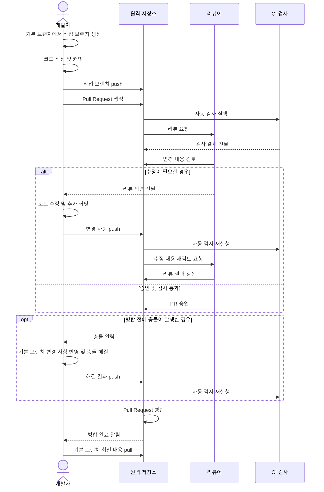

# Pull Request 따라하기

## Pull Request란?

Pull Request(PR)는 작업 브랜치의 변경 사항을 기본 브랜치에 반영해 달라고 요청하는 기능입니다. PR을 사용하면 변경 내용을 검토하고 의견을 주고받은 뒤 안전하게 병합할 수 있습니다.

## Pull Request의 역사

Pull Request는 분산 버전 관리에서 다른 개발자의 저장소에 변경 사항을 제안하던 작업 방식에서 출발했습니다. GitHub는 2008년 서비스를 시작한 뒤 이 방식을 웹 기반 협업 기능으로 발전시켰고, 코드 리뷰와 자동화 검사를 병합 전에 수행하는 현재의 PR workflow를 널리 확산시켰습니다.

오늘날 PR은 단순한 병합 요청을 넘어 변경 이유와 검증 결과를 기록하고, 리뷰어의 의견을 반영하며, CI/CD 검사 결과를 함께 확인하는 협업 단위로 사용됩니다.

## Pull Request 진행 과정



## 단계별 예시

### 1. 기본 브랜치에서 작업 브랜치 만들기

```powershell
git switch master
git pull origin master
git switch -c feature/login
```

브랜치 이름은 작업 목적이 드러나도록 `feature/기능명`, `fix/버그명`, `docs/문서명`과 같이 작성합니다.

### 2. 변경 사항 작성 및 확인

파일을 수정한 뒤 변경 상태와 차이를 확인합니다.

```powershell
git status
git diff
```

### 3. 커밋 만들기

```powershell
git add .
git commit -m "docs: add pull request guide"
```

커밋 메시지는 변경 목적을 간단하고 명확하게 작성합니다.

### 4. 원격 저장소에 브랜치 푸시하기

```powershell
git push -u origin feature/login
```

`-u` 옵션을 사용하면 로컬 브랜치와 원격 브랜치가 연결되어 이후에는 `git push`만 입력해도 됩니다.

### 5. GitHub에서 Pull Request 만들기

GitHub 저장소에서 `Compare & pull request`를 선택하거나 다음 정보를 입력합니다.

- base: 변경 사항을 반영할 기본 브랜치
- compare: 작업 내용을 담은 작업 브랜치
- 제목: 변경 목적을 요약한 제목
- 본문: 변경 내용, 테스트 방법, 검토할 사항

예시 본문:

```markdown
## 변경 내용
- Pull Request 사용법 문서를 추가했습니다.

## 확인 방법
- 문서의 명령어 예시를 확인했습니다.
```

## PR 검토와 수정

리뷰어의 의견을 반영한 뒤 같은 브랜치에 추가 커밋을 만들고 푸시하면 PR에 자동으로 반영됩니다.

```powershell
git add .
git commit -m "docs: revise pull request guide"
git push
```

PR의 `Files changed` 탭에서 실제 변경 내용을 확인하고, `Conversation` 탭에서 리뷰 의견과 답변을 관리합니다.

## PR 병합하기

리뷰와 필요한 검사가 끝나면 GitHub의 `Merge pull request`를 선택합니다. 병합 방식은 저장소 정책에 따라 선택합니다.

- Create a merge commit: 병합 커밋을 남깁니다.
- Squash and merge: 여러 커밋을 하나로 합칩니다.
- Rebase and merge: 커밋을 직선형 이력으로 반영합니다.

병합이 끝나면 로컬 기본 브랜치를 최신 상태로 갱신합니다.

```powershell
git switch master
git pull origin master
git branch -d feature/login
```

## 충돌이 발생하면

기본 브랜치의 최신 내용을 작업 브랜치에 반영한 뒤 충돌을 해결합니다.

```powershell
git switch feature/login
git fetch origin
git merge origin/master
```

충돌 파일의 표시를 정리하고 다음 명령으로 병합을 마무리합니다.

```powershell
git add <해결한-파일>
git commit
git push
```

## GitHub CLI로 PR 만들기

GitHub CLI를 사용하면 터미널에서도 PR을 생성하고 확인할 수 있습니다.

```powershell
gh auth login
gh pr create --base master --head feature/login --title "feat: add login" --body "로그인 기능을 추가했습니다."
gh pr list
gh pr view <번호>
gh pr merge <번호>
```
